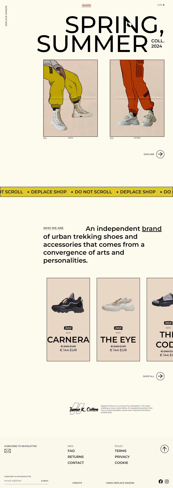

# Frontend Practice - Déplacé Maison

This is a solution to the [Déplacé Maison challenge on Frontend Practice](https://www.frontendpractice.com/projects/deplace-maison).

## Table of contents

- [Overview](#overview)
  - [The challenge](#the-challenge)
  - [Screenshot](#screenshot)
  - [Links](#links)
- [My process](#my-process)
  - [Built with](#built-with)

## Overview

### The challenge

- Unique layout
- Cursor animations
- Draggable slider
- Hover effects

### Screenshot

### Links

- Live Site URL: [https://deplace-maison-home.vercel.app/]

## My process

### Built with

- Semantic HTML5 markup
- JavaScript
- SCSS - For styles
- GSAP - For animations
